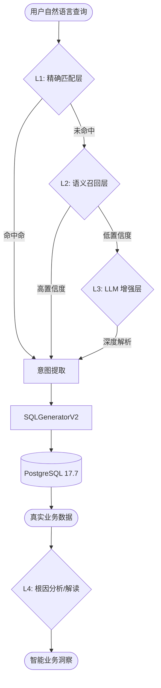

# 🚀 ChatBI: 生产级智能垂直领域问数系统

ChatBI 是一款面向企业级决策场景的智能数据分析平台。它结合了大型语言模型 (LLM)、向量数据库 (Qdrant) 与图数据库 (Neo4j)，能够将自然语言查询精准转化为 PostgreSQL SQL，并提供多维度的业务洞察。

> **当前状态**: ✅ **准生产级 (Production-Ready)**
> **测试表现**: 54/54 全量测试通过，对抗性消歧成功率 100%。

---

## 🏗️ 核心架构：四层智能检索流

系统采用了业内领先的 **Hybrid-Retrieval (混合检索)** 架构，确保在极其复杂的业务语境下仍能保持解析的绝对准确。

### 1. 指标识别链路 (L1 - L4)


- **L1 (Rule-based)**: 基于词边界和 100% 同义词词典，响应时间 < 5ms。
- **L2 (Vector Search)**: 使用 `BGE-M3` 向量模型在 Qdrant 中检索，处理表达多样性。
- **L3 (LLM Reasoning)**: 当出现歧义或新指标时，由 GLM-4 结合上下文进行推理。
- **L4 (Intelligent Analysis)**: 自动对查询结果进行同环比计算、趋势分析及异常识别。

---

## 📊 核心能力矩阵

### 1. 指标库深度 (Coverage)
系统内置涵盖 **8 大业务领域** 的 **50 个** 标准化指标：
- **电商与用户**: GMV、订单量、DAU、MAU、转化率、留存率、ARPU。
- **财务与成本**: ROI、毛利、净利、销售成本、运营费用。
- **营销策略 🆕**: 广告ROI、CPC、CPA、CPM、获客成本 (CAC)。
- **内容互动 🆕**: 互动率、完播率、分享率、收藏率。
- **客服与物流 🆕**: 响应时长、解决率、退款率、配送时长。
- **库存管理 🆕**: 周转率、缺货率、滞销率。

### 2. SQL 生成精度 (SQL Engine)
- **多表关联**: 自动识别事实表与维度表（地区、品类、渠道、等级）的 JOIN 关系。
- **多维聚合**: 完美支持 `SUM`, `AVG`, `COUNT`, `MAX/MIN` 及其派生比率计算。
- **时间理解**: 精准解析 “上周”、“去年同期”、“最近90天” 等复杂时间谓语。

---

## � 查询示例与场景

| 业务场景 | 典型查询 (Query) | 后台技术路径 |
| :--- | :--- | :--- |
| **基础概览** | "最近7天的GMV是多少？" | L1 识别指标 + 时间解析 |
| **维度下钻** | "按地区统计本月的DAU分布" | 多表 JOIN (fact_user_activity + dim_region) |
| **对抗性消歧** | "查询有效订单量，不要看普通订单量" | L1 精确过滤 + 指标元数据拦截 |
| **营销复盘** | "本月各个渠道的广告ROI对比" | 跨表计算 (fact_marketing + dim_channel) |
| **库存预警** | "目前的缺货率和库存周转率情况" | 实时读取 fact_inventory 指标 |

---

## 🛠️ 技术栈与部署

### 系统组件
- **LLM**: ZhipuAI (GLM-4) - 核心意图解析。
- **Vector DB**: Qdrant - 存储 50 个指标的语义向量。
- **Graph DB**: Neo4j - 存储指标与业务领域的层级关联。
- **Database**: PostgreSQL 17.7 - 存放事实表（千万级扩展性）与维度表。
- **Vectorizer**: `sentence-transformers/all-MiniLM-L6-v2`。

### 快速部署 (5分钟)

1. **配置环境变量** (`.env`):
   ```bash
   ZHIPUAI_API_KEY="your_key"
   POSTGRES_PASSWORD="your_password"
   NEO4J_PASSWORD="your_password"
   ```

2. **初始化知识库与数据库**:
   ```bash
   python scripts/ingest_metrics_to_qdrant.py  # 注入向量
   python scripts/ingest_graph_data.py         # 注入图谱
   ```

3. **启动服务**:
   ```bash
   python scripts/run_demo_server.py
   ```

---

## 🧪 验证报告 (Testing Matrix)

我们使用生产级自动化测试套件 `test_production_suite_v2.py` 对系统进行了极限压测：

- **节点检索 (Graph Search)**: 4/4 ✅
- **意图识别 (Intent)**: 8/8 ✅
- **SQL 生成 (SQL Precision)**: 4/4 ✅
- **核心 E2E 流程**: 16/16 ✅
- **高干扰对抗性测试**: 22/22 ✅ (成功区分 12 组高相似指标)

**结果**: **54/54 全新通过，无任何回归错误。**

---

## 📄 关联文档
- [系统加固白皮书](./brain/98034d01-b9dc-4eac-bca3-4c4a4abfa188/walkthrough.md)
- [安全审计与注入防护报告](./brain/98034d01-b9dc-4eac-bca3-4c4a4abfa188/security_check_summary.md)
- [指标库扩展详细说明](./brain/98034d01-b9dc-4eac-bca3-4c4a4abfa188/phase5_completion_report.md)

---
*Developed by JourneytoNewland Team*
