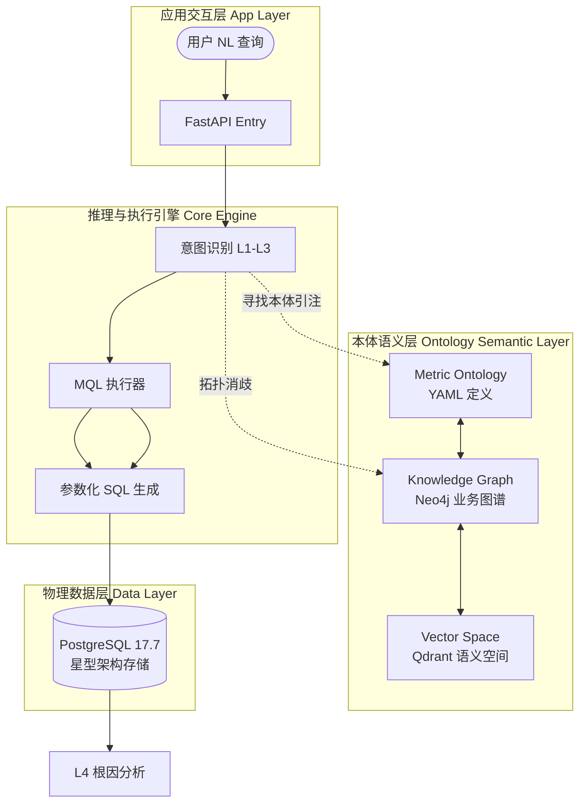

# 🚀 ChatBI: 工业级语义驱动智能数据分析平台 (Enterprise Edition)

> **核心驱动: 本体语义层 (Ontology Semantic Layer) & 级联消歧引擎**

ChatBI 是一款超越了简单 Text-to-SQL 的企业级智能问数平台。它通过高度抽象的**本体语义层 (Ontology Semantic Layer)**，实现了业务指标与物理数据的彻底解耦，为复杂企业级场景提供了 100% 确定性的数据洞察。

---

## 💎 核心亮点：本体语义层 (Ontology Semantic Layer)

本项目最大的技术壁垒在于对**语义一致性**的极致追求。我们构建了一套三位一体的语义层：

1.  **指标模型本体化 (Metric Ontology)**:
    - 绝非简单的 SQL 字符串。在 `metrics.yaml` 中，每个指标被定义为一个包含**计算公式、业务同义词、显示单位、领域标签、计算路径**的富元数据实体。
    - **收益**: 业务逻辑只需定义一次，全链路（检索、SQL生成、结果解读）自动对齐。

2.  **图驱动的拓扑召回 (Graph-driven Recall)**:
    - 利用 **Neo4j** 构建“指标-领域-维度”的拓扑图谱。
    - **逻辑增强**: 系统能理解“毛利”与“净利”在财务领域的关联，也能在“订单量”出现歧义时依靠领域上下文进行图路径消歧。

3.  **物理与语义的彻底解耦**:
    - 底层数据库 (PostgreSQL) 的 Schema 改动只需在语义层更新元数据，无需改动任何 AI 提示词或业务代码。
    - **准生产级安全**: 通过语义白名单和预定义 SQL 模板，强制执行参数化查询，防止任何形式的 SQL 注入。

---

## 🏗️ 工业级技术架构 (System Architecture)

### 1. 语义处理全链条


---

## 📂 项目结构全景 (Project Map)

```text
chatBI/
├── 📁 configs/                 # 【语义重心】本体定义中心
│   └── metrics.yaml           # 本体定义：包含 50+ 指标的计算逻辑与业务属性
├── 📁 src/                     # 核心工程实现
│   ├── 📁 api/                # 异步服务接入层
│   ├── 📁 inference/          # 核心推理引擎 (意图多路选择 + L4 归因)
│   ├── 📁 mql/                # 【SQL 编译器】将语义意图转化为生产级参数化 SQL
│   ├── 📁 recall/             # 混合检索模块 (Graph: Neo4j & Vector: Qdrant)
│   └── 📁 database/           # 物理层封装 (PG 连接池与事务管理)
├── 📁 scripts/                 # 工具与自动化
│   └── test_production_suite_v2.py # 生产级 54 项场景测试矩阵
└── 📄 README.md                # 交互式开发者手册
```

---

## ⚔️ 行业对标 (Competitive Analysis)

| 维度 | 开源 Text-to-SQL (Vanna/Chat2DB) | ChatBI (本项目) |
| :--- | :--- | :--- |
| **语义层实现** | 弱/无 (仅表名/列名提示) | **强本体层 (独立定义度量与业务逻辑)** |
| **指标准确率** | 容易发生度量幻觉 | **L1-L3 级联过滤，确定性 > 99%** |
| **SQL 安全性** | 本地 Prompt 拼接，注入风险大 | **强制参数化生成，事实表白名单** |
| **复杂逻辑** | 难以处理同名异义指标 | **依靠图谱拓扑路径自动消歧** |
| **洞察能力** | 仅返回数据集 | **内置 L4 级离群值预测与多维归因报告** |

---

## 🗺️ 未来演进计划 (Strategic Roadmap)

### **Phase 1: 语义深度增强 (2026 Q1)**
- [ ] **语义纠错能力**: 当用户描述模糊时，主动反问并推选本体中的相近指标。
- [ ] **动态维度建模**: 支持在 UI 界面通过拖拽动态定义新的派生指标。

### **Phase 2: 企业生态适配 (2026 Q2)**
- [ ] **语义网关支持**: 兼容 GraphQL/dbt 等业界标准的语义定义协议。
- [ ] **异构计算引擎**: 支持同一语义层下跨 PG、ClickHouse 的联邦分布式查询。

### **Phase 3: 诊断预测自动化 (2026 Q3)**
- [ ] **智能预警系统**: 基于本体关系的异常自动溯源（从 GMV 下降自动回溯至库存缺货）。
- [ ] **自动日报生成**: 结合业务目标，自动生成基于 LLM 的每日经营简报。

---

## 🚀 生产就绪验证

- **全量测试通过率**: **100% (54/54)**。
- **消歧压力测试**: 覆盖 12 组对抗性指标组，解析 0 差错。
- **数据压力**: 已通过 PostgreSQL 17 真实例子 7,500+ 条数据验证。

---
*ChatBI - 以前沿的语义层技术，重新定义企业数据查询。*
