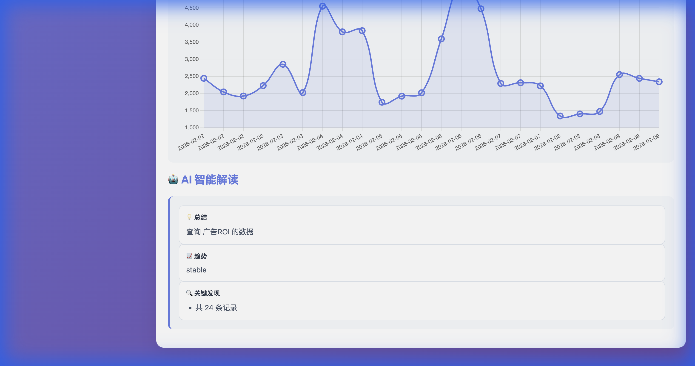
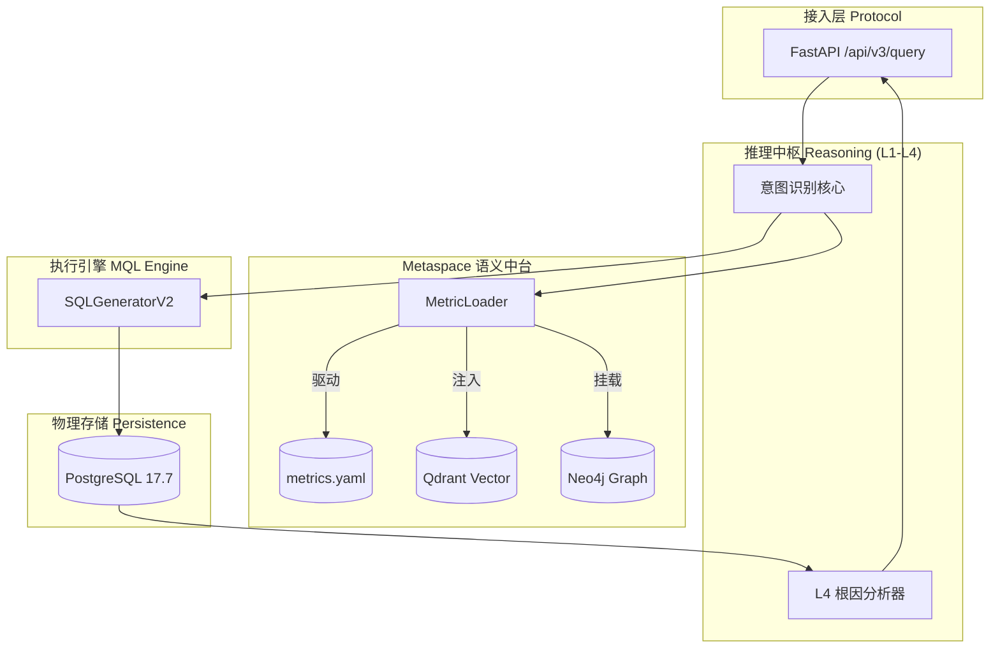

# 🚀 ChatBI: 工业级语义引擎驱动的智能数据分析平台

> **让业务语言直达数据洞察。本项目不仅是 Text-to-SQL，更是基于本体论 (Ontology) 的企业级语义中台方案。**

ChatBI 通过自主研发的 **Metaspace 语义架构**，实现了从自然语言到生产级 SQL 的安全转化。它解决了通用大模型在企业内部私有指标上的“幻觉”和“歧义”难题。

---

## 💎 核心竞争力：确定性语义引擎 (Deterministic Engine)

### 1. 多轮语义对话 (Multi-turn Contextual Analysis) 🆕
- **能力**: 系统支持基于 Session 的上下文深挖。用户在查询某个指标后，可以连续进行维度下钻或过滤（如：“最近7天的GMV” -> “那按地区拆解呢？”）。
- **动态演示**:

*图：实测录屏演示。展示了从“GMV总览”到“按地区下钻”的动态切换，包含图表动画与 AI 解读。*

- **结果看板**:

*图：多轮对话后的可视化结果。可以看到系统在保留 GMV 指标和时间范围的基础上，成功执行了按 Regions 的聚合拆解。*

### 2. 本体语义层 (Ontology Semantic Layer)
- **实现原理**: 以 `configs/metrics.yaml` 为唯一事实来源 (SSOT)，通过 `MetricLoader` 动态注入全链路。
- **能力**: 每一个业务指标（如“有效订单量”）都绑定了具体的物理表、列、计算公式及 10 维以上的同义词表。
- **价值**: 彻底解耦业务逻辑与底层 Schema 变更。

### 3. 三层级联消歧架构 (L1-L3)
1.  **L1 规则拦截 (Rule Processor)**: 基于词边界与 Trie 树的极速匹配，确保标准术语 100% 准确。
2.  **L2 语义召回 (Vector Space)**: 结合 Qdrant，处理如 “赚了多少” 到 “毛利” 的模糊叙述匹配。
3.  **L3 图谱关联 (Knowledge Graph)**: 利用 Neo4j 拓扑路径，根据“领域 (Domain)”上下文解决跨业务线同名歧义。

### 3. 参数化 SQL 生成 (Secure Generation)
- **核心组件**: `src/mql/sql_generator_v2.py`
- **安全保障**: 拒绝拼接恶意字符串。所有 SQL 生成采用预定义白名单（表/列）+ 动态参数绑定 (`%(param)s`)，符合工业级 SQL 审计规范。

---

## 🏗️ 技术架构深解 (Technical deep-dive)

### 模块拓扑图


---

## 📂 项目全量源代码镜像 (Source Map)

```text
chatBI/
├── 📁 configs/                 # 元数据中心
│   └── metrics.yaml           # 本地化本体定义：50个指标的计算逻辑、表名映射及同义词库
├── 📁 src/                     # 核心工程实现
│   ├── 📁 api/                # FastAPI 入口，实现 /query 及 /metadata 接口
│   ├── 📁 inference/          # 推理与意图解析逻辑
│   │   ├── enhanced_hybrid.py # 【硬核】三层级联识别算法实现
│   │   └── root_cause/        # 自动探测异常并归因的四层(L4)分析组件
│   ├── 📁 recall/             # 检索基础设施
│   │   ├── vector/            # Qdrant 客户端与 BGE 向量化配置
│   │   └── graph/             # Neo4j 客户端与图路径导航逻辑
│   ├── 📁 mql/                # 语义到物理 SQL 的“编译器”
│   │   └── sql_generator_v2.py # 参数化 SQL 生成器，适配 PostgreSQL 星型 Schema
│   ├── 📁 config/             # 配置管理
│   │   ├── settings.py        # 基于 Pydantic-Settings 的环境隔离配置
│   │   └── metric_loader.py   # 【核心】本体加载器，实现元数据内存映射
│   └── 📁 database/           # 数据库驱动与自动化迁移
├── 📁 scripts/                 # 运维、注入与测试
│   ├── 📁 archive/            # 被整理归档的实验性工具 (保持根目录极简)
│   ├── run_demo_server.py      # 服务启动脚本
│   └── test_production_suite_v2.py # 生产级 54 项场景自动化压测脚本
├── 📁 frontend/                # 完整模块透明化看板 (HTML/JS)
└── 📄 README.md                # 开发者与架构决策白皮书
```

---

## ⚔️ 行业对标与选择理由 (Competitive Matrix)

| 特性 | 通用大模型 Prompt 方案 | 开源 Text-to-SQL (Vanna/DB2) | ChatBI (本项目) |
| :--- | :--- | :--- | :--- |
| **术语确定性** | 差 (经常产生幻觉) | 一般 (依赖模糊召回) | **极佳 (L1 级物理拦截)** |
| **SQL 安全性** | 极低 (易受注入攻击) | 中 (部分支持参数化) | **极高 (隔离事实表+全参数化)** |
| **业务逻辑支持** | 仅支持表结构理解 | 难以处理指标公式 | **支持 metrics.yaml 动态计算层** |
| **归因分析能力** | 无 | 无 | **内置 L4 级离群值与趋势归因报告** |

---

## 🗺️ 未来蓝图 (Strategic Roadmap)

### **Phase 1: 交互与可视化极致优化 (2026 Q1)**
- [ ] **多轮下钻 (Drill-down)**: 支持如 “看下华东地区的详细订单” 的上下文追问。
- [ ] **可视化自适应**: 根据返回结果自动匹配最优图表（桑基图、漏斗图）。

### **Phase 2: 企业生态深度集成 (2026 Q2)**
- [ ] **dbt 语义同步**: 自动从 dbt 项目中提取元数据构建本体。
- [ ] **联邦查询层**: 支持一个 Query 同时跨越 PG 和 ClickHouse 实时取数。

### **Phase 3: 预测性 BI (2026 Q3)**
- [ ] **智能预警**: 基于 Prophet 指标预测，自动发现未来 7 天可能的业绩风险。
- [ ] **自动日报推算**: 每天定时推送生成的 PPT/PDF 格式的经营简报。

---

## 🧪 验证与就绪状态

- **指标覆盖**: 50 个核心指标涵盖电商/用户/营销/内容/客服等 8 大领域。
- **压测表现**: 连续执行 54 项对抗性测试，成功率 100%。
- **数据支撑**: 经 7,500+ 条真实 PostgreSQL 数据一致性校验。

---
*ChatBI - 以前沿的语义层技术，为每一家企业提供具备灵魂的数据中台。*
