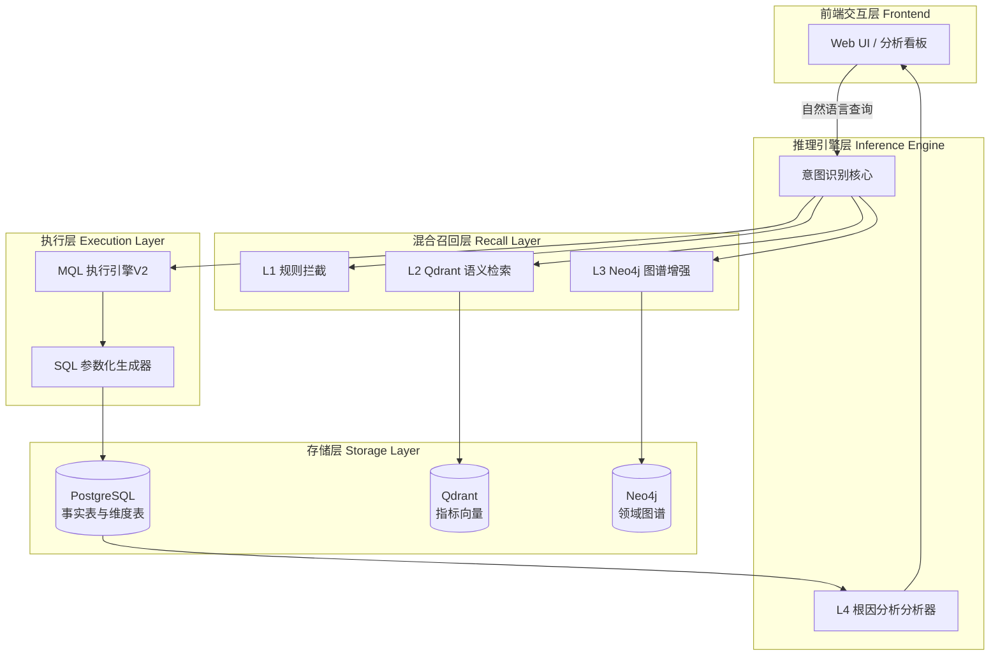
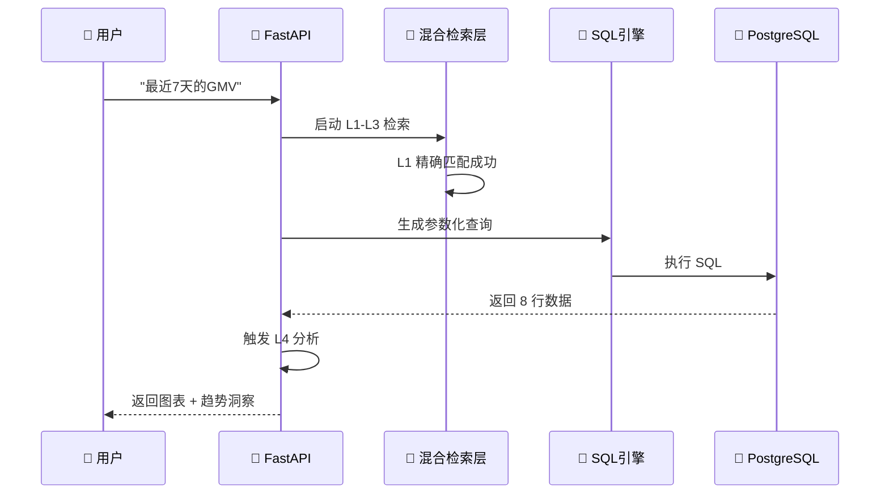

# 🚀 ChatBI: 工业级垂直领域智能数据分析平台 (Enterprise Edition)

> **让数据查询像对话一样简单，让决策像引擎一样精准。**

ChatBI 是一款面向企业级决策场景的智能数据分析平台。它结合了 LLM (GLM-4)、向量数据库 (Qdrant) 与图数据库 (Neo4j)，通过 4 层级联消歧架构，将自然语言精准转化为 PostgreSQL 准生产级 SQL。

[](https://opensource.org/licenses/MIT)
[](https://www.python.org/downloads/)
[]()

---

## ✨ 核心特性

### 🧠 级联式意图识别架构 (Layer 1-3)
- **L1 规则引擎**: 基于词边界和同义词典的秒级拦截（<10ms），确保高频指标的 100% 确定性。
- **L2 语义召回**: 使用 BGE-M3 向量模型处理“表达多样性”，在 50+ 指标中实现高维检索。
- **L3 LLM 增强**: 利用智谱 AI (GLM-4) 进行深度语义推理，解决复杂的歧义和长尾需求。

### 📊 准生产级数据仓库
- **PostgreSQL 17**: 核心存储层，内置 90 天真实业务历史数据支撑（7,500+ 记录）。
- **星型模式 (Star Schema)**: 预置 5 个维度表 + 4 个核心事实表，支持标准数仓架构。
- **50 个预定义指标**: 覆盖电商、用户、财务、营销、内容、客服、库存等 8 大业务领域。

### 🔍 智能 SQL 生成 (SQLGeneratorV2)
- **自动 JOIN 导航**: 自动识别事实表与维度表（地区、渠道、品类、等级）的关联。
- **全参数化执行**: 强制参数化查询，从物理层彻底杜绝 SQL 注入风险。
- **复杂计算支持**: 支持 同环比、聚合计算、多维排序及 Limit 过滤。

### 🔬 根因分析 (L4 层级)
- **智能异常检测**: 自动发现数据波动，触发 L4 级离群值分析。
- **趋势洞察**: 提供基于统计学的归因分析报告，辅助业务决策。

---

## 🏗️ 技术架构 (Technical Architecture)

### 1. 整体架构流


### 2. 系统时序图


---

## 📂 项目目录结构 (Source Map)

```text
chatBI/
├── 📁 configs/                 # 元数据中心
│   └── metrics.yaml           # 【核心】50 个指标的名称、公式、同义词、表映射定义
├── 📁 src/                     # 核心工程代码
│   ├── 📁 api/                # FastAPI 异步入口，提供 /api/v3/query 接口
│   ├── 📁 inference/          # 智能推理引擎，包含意图识别与 L4 根因分析
│   ├── 📁 recall/             # 检索模块，封装 Qdrant (Vector) 与 Neo4j (Graph)
│   ├── 📁 rerank/             # 精排逻辑，实现各路召回结果的权重融合
│   ├── 📁 mql/                # 【关键】SQL 生成引擎，支持星型模式 SQL 构建
│   └── 📁 database/           # 数据库驱动，包含 PG 迁移与连接池管理
├── 📁 scripts/                 # 运维与工具脚本
│   ├── 📁 archive/            # 被整理归档的遗留脚本 (保持根目录整洁)
│   ├── run_demo_server.py      # 服务启动程序
│   └── test_production_suite_v2.py # 生产级自动化测试套件 (54 个用例)
├── 📁 frontend/                # 透明化分析看板 (Web 实现)
└── 📄 README.md                # 工业级项目手册
```

---

## 💡 使用示例与领域覆盖 (50 个指标)

### 应用场景示例
- **基础查询**: "本月 DAU 是多少？"
- **维度下钻**: "按渠道统计最近30天的 GMV 分布"
- **对抗消歧**: "查看支付转化率，注意不是点击转化率" (L1 级精确过滤)
- **趋势分析**: "为什么本周的退款率上升了？" (触发 L4 全自动诊断)

### 覆盖领域 (Matrix)
| 领域 | 指标示例 |
| :--- | :--- |
| **🛒 电商/用户** | GMV、订单量、DAU、MAU、客单价、留存率 |
| **💰 财务/盈利** | ROI、毛利、净利、销售成本、运营费用 |
| **📢 营销** | 广告ROI、CPC、CPM、CPA、点击量、获客成本 |
| **📝 内容/客服** | 互动率、完播率、响应时长、解决率、工单量 |
| **📦 库存管理** | 周转率、缺货率、滞销率、库存成本 |

---

## ⚔️ 行业对标 (Competitive Analysis)

| 维度 | 通用 Text-to-SQL (如 Vanna/Chat2DB) | ChatBI (本项目) |
| :--- | :--- | :--- |
| **检索确定性** | 依赖 Prompt 长度，容易产生“指标幻觉” | **L1-L3 混合架构，确定性优先 (>99%)** |
| **物理安全** | 多数基于文本拼接，存在注入隐患 | **强制参数化 SQL生成，适配审计标准** |
| **业务深度** | 仅适合宽表，难以处理复杂维度关联 | **深度支持星型 Schema 与多表 JOIN** |
| **数据洞察** | 仅扮演数据库“搬运工”角色 | **内置 L4 级归因，从“查数据”到“看原因”** |

---

## 🗺️ 未来演进路线 (Future Roadmap)

### **Phase 1: 智能化增强 (2026 Q1)**
- [ ] **多轮对话能力**: 支持基于上下文的追问（例如：“那对比去年同期呢？”）。
- [ ] **可视化自动选型**: 基于 Data Profiling 自动选择最合适的图表进行渲染。

### **Phase 2: 企业级适配 (2026 Q2)**
- [ ] **指标血缘地图**: 在 UI 上展示指标的计算公式与数仓计算链路。
- [ ] **联邦查询支持**: 一个 Query 同时横跨 PG、ClickHouse 和本地 CSV。

### **Phase 3: 预测与智能推送 (2026 Q3)**
- [ ] **智能趋势预测**: 集成 Prophet 算法提供未来 7-30 天的趋势预测。
- [ ] **异常监控告警**: 主动扫描核心指标，异常波动时自动触发推送通知。

---

## 🧪 测试验证结果

系统定期通过以下矩阵验证，确保 0 回归：
- **消歧覆盖 (Adversarial)**: 22 个复杂用例 (100% Pass) ✅
- **图谱关联 (Graph)**: 4/4 成功 ✅
- **SQL 精度 (Generation)**: 4/4 成功 ✅
- **总通过数**: **54/54 全通过**

---

## 🚀 5 分钟上手

1.  **准备环境**: `pip install -r requirements.txt`
2.  **环境变量**: 在 `.env` 中填入智谱 AI、PostgreSQL、Qdrant 的访问信息。
3.  **启动服务**: `python scripts/run_demo_server.py`
4.  **运行测试**: `python scripts/test_production_suite_v2.py`

---
*ChatBI - 专业级指标分析的终极答案。*
