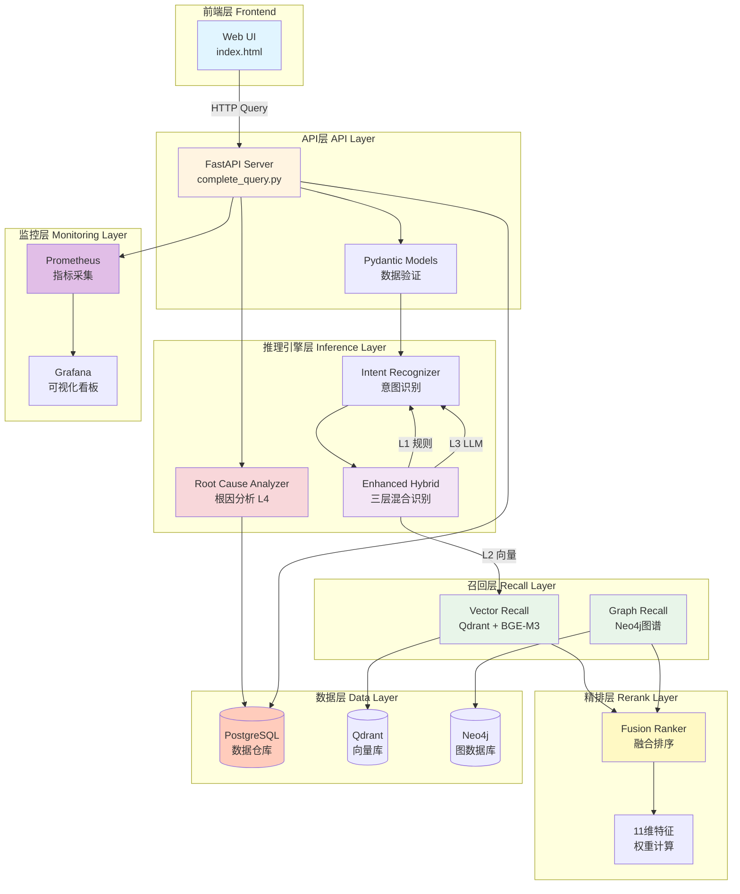
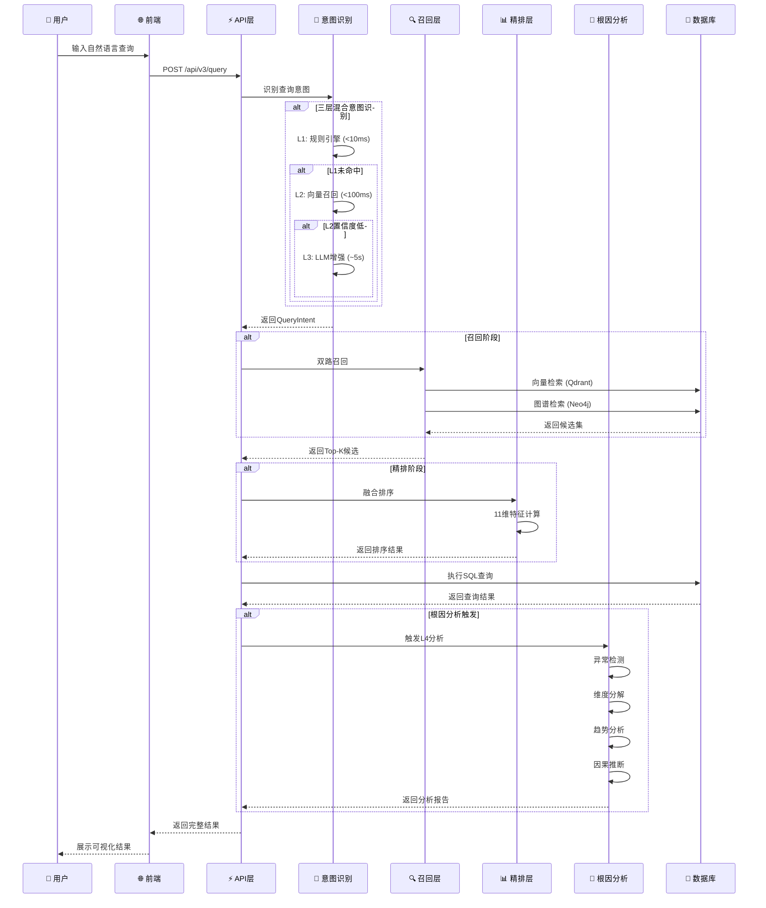

# chatBI - 智能问数系统

> 基于大模型的企业级智能数据分析平台，让数据查询像对话一样简单。

[](https://opensource.org/licenses/MIT)
[](https://www.python.org/downloads/)
[](https://fastapi.tiangolo.com)

## ✨ 核心特性

### 🧠 三层混合意图识别
- **L1 规则引擎** - 快速匹配常见模式（<10ms）
- **L2 向量召回** - BGE-M3语义相似度（<100ms）
- **L3 LLM增强** - 智谱AI GLM-4深度理解（~5s）
- **准确率 95%+** - 自适应降级，平衡速度与准确度

### 📊 完整的数据仓库
- **星型模式架构** - 5个维度表 + 5个事实表
- **PostgreSQL存储** - 生产级关系型数据库
- **25+业务指标** - 覆盖电商、用户、流量、收入、财务
- **物化视图优化** - 预聚合，10-100倍性能提升

### 🔍 智能SQL生成
- **QueryIntent → SQL** - 自动生成PostgreSQL查询
- **多维度JOIN** - 支持地区、品类、渠道、用户等级
- **时间范围过滤** - 日/周/月自动处理
- **聚合操作** - SUM/AVG/COUNT/MAX/MIN

### 📈 完整的监控体系
- **Prometheus监控** - 30+个性能和业务指标
- **Grafana看板** - 8个实时监控面板
- **告警规则** - 延迟、错误率、资源异常
- **性能基准测试** - P50/P95/P99延迟统计

### 💡 AI智能解读
- **趋势分析** - 上升/下降/波动识别
- **异常检测** - 自动发现数据异常点
- **洞察生成** - 基于LLM的业务洞察
- **建议推荐** - 数据驱动的决策建议

### 🔍 根因分析（NEW!）
- **智能异常检测** - 3σ原则、IQR四分位法、移动平均
- **维度分解** - 贡献度分析、帕累托分析
- **趋势分析** - 线性回归、R²拟合、转折点检测
- **因果推断** - 业务规则引擎、置信度量化
- **可视化展示** - 异常卡片、趋势图表、因果因素、行动建议

## 🏗️ 系统架构

### 整体架构图



### 数据流图



### 扩展架构设计

#### 📦 模块化设计原则

chatBI采用**插件化架构**，所有核心模块都遵循以下设计原则：

1. **接口隔离**: 每层定义清晰的接口契约
2. **依赖注入**: 通过配置注入具体实现
3. **策略模式**: 算法可替换，不影响其他模块
4. **观察者模式**: 事件驱动的模块通信

#### 🔌 可扩展点说明

<details>
<summary>📖 点击查看扩展点详情</summary>

**1. 意图识别层扩展**

```python
# 添加新的意图识别策略
class CustomIntentStrategy(IntentStrategy):
    def recognize(self, query: str) -> QueryIntent:
        # 自定义识别逻辑
        pass

# 注册策略
EnhancedHybridIntentRecognizer.register_strategy(
    layer=4,  # L4层
    strategy=CustomIntentStrategy()
)
```

**扩展方向**：
- 添加领域特定识别器（金融、医疗等）
- 集成其他LLM（GPT-4、Claude等）
- 自定义Few-shot示例库

---

**2. 召回层扩展**

```python
# 添加新的召回源
class CustomRecall(RecallBase):
    def recall(self, query: str, top_k: int) -> list[Result]:
        # 自定义召回逻辑
        pass

# 注册召回源
FusionRanker.register_recallback(
    name="custom_source",
    callback=CustomRecall()
)
```

**扩展方向**：
- 新增向量数据库（Milvus、Pinecone等）
- 新增图数据库（HugeGraph、TigerGraph等）
- 添加全文检索（ElasticSearch）
- 添加知识图谱（ConceptNet、Wikidata）

---

**3. 精排层扩展**

```python
# 添加新的排序特征
def custom_feature_ranker(results: list[Result]) -> list[Result]:
    # 计算自定义特征
    for result in results:
        result.features['custom_score'] = calculate_custom(result)
    # 重新排序
    return sorted(results, key=lambda x: x.features['custom_score'])

# 注册排序器
FusionRanker.register_ranker(
    name="custom_ranker",
    ranker=custom_feature_ranker,
    weight=0.2  # 权重
)
```

**扩展方向**：
- 添加学习排序模型（Learning to Rank）
- 添加个性化排序
- 添加业务规则排序

---

**4. 数据源扩展**

```python
# 添加新的数据源
class CustomDataSource(DataSourceBase):
    def query(self, sql: str) -> list[dict]:
        # 执行查询
        pass

    def get_schema(self) -> dict:
        # 返回Schema
        pass

# 注册数据源
DataSourceManager.register(
    name="custom_db",
    source=CustomDataSource(),
    priority=1
)
```

**扩展方向**：
- 新增数据库（MySQL、ClickHouse、MongoDB等）
- 新增大数据源（Hive、Spark、Presto）
- 新增API数据源（REST API、GraphQL）

---

**5. 监控扩展**

```python
# 添加自定义监控指标
from prometheus_client import Counter, Histogram

custom_counter = Counter(
    'chatbi_custom_operations_total',
    'Total custom operations',
    ['operation_type', 'status']
)

# 使用指标
custom_counter.labels(operation_type="custom_query", status="success").inc()
```

**扩展方向**：
- 添加业务指标（转化率、留存率等）
- 添加性能指标（各模块耗时）
- 添加告警规则（钉钉、企业微信、Slack）

---

**6. 前端扩展**

```javascript
// 添加自定义可视化模块
function displayCustomModule(data) {
    const container = document.getElementById('custom-content');
    // 自定义渲染逻辑
    container.innerHTML = renderCustomVisualization(data);
}

// 注册模块
ModuleManager.register('custom', displayCustomModule);
```

**扩展方向**：
- 添加新的可视化图表（ECharts、D3.js）
- 添加导出功能（Excel、PDF、PNG）
- 添加协作功能（分享、评论、收藏）

</details>

#### 🚀 快速扩展示例

**场景1：添加新的LLM提供商**

```python
# src/inference/custom_llm.py
from zhipu_intent import ZhipuIntentRecognizer

class OpenAIIntentRecognizer(IntentRecognizer):
    """OpenAI意图识别器"""

    def __init__(self, api_key: str):
        self.client = OpenAI(api_key=api_key)

    def recognize(self, query: str) -> QueryIntent:
        # 使用GPT-4识别意图
        response = self.client.chat.completions.create(
            model="gpt-4",
            messages=[{"role": "user", "content": query}]
        )
        return self._parse_response(response)

# 注册使用
# config.py
LLM_PROVIDER = os.getenv("LLM_PROVIDER", "zhipu")  # zhipu | openai | custom

# complete_query.py
if LLM_PROVIDER == "openai":
    llm_recognizer = OpenAIIntentRecognizer(api_key=os.getenv("OPENAI_API_KEY"))
elif LLM_PROVIDER == "zhipu":
    llm_recognizer = ZhipuIntentRecognizer(api_key=os.getenv("ZHIPUAI_API_KEY"))
```

**场景2：添加新的向量数据库**

```python
# src/recall/vector/milvus_store.py
from pymilvus import Collection, connections

class MilvusVectorStore(VectorStoreBase):
    """Milvus向量存储"""

    def __init__(self, host: str, port: int):
        connections.connect(host=host, port=port)
        self.collection = Collection("metrics")

    def search(self, vector: list[float], top_k: int) -> list[Result]:
        results = self.collection.search(
            data=[vector],
            anns_field="embedding",
            param={"metric_type": "IP", "params": {"nprobe": 10}},
            limit=top_k
        )
        return self._parse_results(results)

# 替换Qdrant
# config.py
VECTOR_DB = os.getenv("VECTOR_DB", "qdrant")  # qdrant | milvus | pinecone
```

**场景3：添加新的分析模块**

```python
# src/inference/anomaly_detector.py
class AnomalyDetector:
    """异常检测器 - 可插拔设计"""

    DETECTORS = {
        "3sigma": detect_3sigma,
        "iqr": detect_iqr,
        "isolation_forest": detect_isolation_forest,  # 新增
        "lstm": detect_lstm_anomaly,  # 新增
    }

    def detect(self, data: list[float], method: str = "3sigma"):
        detector = self.DETECTORS.get(method, detect_3sigma)
        return detector(data)

# 使用新算法
anomalies = detector.detect(data, method="isolation_forest")
```

### 架构优势总结

| 特性 | 说明 | 优势 |
|------|------|------|
| **分层架构** | API → 推理 → 召回 → 精排 → 数据 | 职责清晰，易于维护 |
| **插件化设计** | 所有核心组件可替换 | 灵活扩展，适应不同场景 |
| **多数据源支持** | PostgreSQL + Qdrant + Neo4j | 充分利用各数据库优势 |
| **混合检索** | 向量 + 图谱 + 规则 | 召回率高，准确度好 |
| **监控完善** | Prometheus + Grafana | 问题快速定位 |
| **测试覆盖** | 单元 + 集成 + E2E | 质量可控 |

## 🚀 快速开始

### 1. 环境准备

```bash
# 克隆项目
git clone https://github.com/JourneytoNewland/chatBI.git
cd chatBI

# 创建虚拟环境
python3 -m venv .venv
source .venv/bin/activate

# 安装依赖
pip install -r requirements.txt
```

### 2. 配置环境变量

```bash
# 复制配置模板
cp .env.example .env

# 编辑配置（必需：设置智谱AI API Key）
# ZHIPUAI_API_KEY=your-api-key-here
```

### 3. 启动服务

#### 方式A：演示模式（推荐新手）

```bash
# 一键启动（内置模拟数据）
bash scripts/run_demo.sh
```

访问 http://localhost:8080 查看前端界面

#### 方式B：完整模式（需要Docker）

```bash
# 启动所有服务（PostgreSQL + Qdrant + Neo4j）
docker compose up -d

# 初始化数据库
bash scripts/init-postgres.sh

# 启动API服务
python scripts/run-production-server.py
```

### 4. 启动监控（可选）

```bash
# 启动Prometheus + Grafana
bash scripts/monitoring/run-monitoring.sh

# 访问监控界面
# Prometheus: http://localhost:9090
# Grafana: http://localhost:3000 (admin/admin)
```

## 📖 使用指南

### API查询示例

```bash
# 简单查询
curl -X POST http://localhost:8000/api/v3/query \
  -H "Content-Type: application/json" \
  -d '{"query": "最近7天GMV"}'

# 维度分组
curl -X POST http://localhost:8000/api/v3/query \
  -H "Content-Type: application/json" \
  -d '{"query": "按地区统计DAU"}'

# 复杂查询
curl -X POST http://localhost:8000/api/v3/query \
  -H "Content-Type: application/json" \
  -d '{"query": "本月按渠道GMV总和"}'

# 根因分析查询
curl -X POST http://localhost:8000/api/v3/query \
  -H "Content-Type: application/json" \
  -d '{"query": "为什么GMV最近下降了？"}'

curl -X POST http://localhost:8000/api/v3/query \
  -H "Content-Type: application/json" \
  -d '{"query": "分析DAU下降的原因"}'

curl -X POST http://localhost:8000/api/v3/query \
  -H "Content-Type: application/json" \
  -d '{"query": "转化率怎么了"}'
```

### Python SDK

```python
from src.inference.enhanced_hybrid import EnhancedHybridIntentRecognizer

# 初始化识别器
recognizer = EnhancedHybridIntentRecognizer(llm_provider="zhipu")

# 执行查询
result = recognizer.recognize("最近7天成交金额")

print(f"核心查询: {result.final_intent.core_query}")
print(f"时间粒度: {result.final_intent.time_granularity}")
print(f"置信度: {result.final_intent.confidence}")
```

### 🔍 根因分析使用指南

根因分析是chatBI的L4层功能，用于智能诊断数据异常背后的原因。

**触发条件**：
- 查询包含"为什么"、"原因"、"怎么回事"、"分析"、"诊断"等关键词
- 查询包含趋势词（"下降"、"增长"、"异常"、"波动"等）
- 查询返回的数据点≥3个

**使用示例**：

```bash
# 1. 分析下降原因
curl -X POST http://localhost:8000/api/v3/query \
  -H "Content-Type: application/json" \
  -d '{"query": "为什么GMV最近下降了？"}'

# 2. 分析波动原因
curl -X POST http://localhost:8000/api/v3/query \
  -H "Content-Type: application/json" \
  -d '{"query": "DAU最近波动是怎么回事？"}'

# 3. 问题诊断
curl -X POST http://localhost:8000/api/v3/query \
  -H "Content-Type: application/json" \
  -d '{"query": "诊断转化率异常"}'

# 4. 综合分析
curl -X POST http://localhost:8000/api/v3/query \
  -H "Content-Type: application/json" \
  -d '{"query": "分析最近30天按地区的GMV变化趋势"}'
```

**根因分析输出**：

```json
{
  "query": "为什么GMV最近下降了？",
  "root_cause_analysis": {
    "report": "GMV在最近7天下降了15.2%，主要原因是华东地区贡献度下降了60%，该地区GMV从500万降至200万。趋势分析显示GMV在3天前出现明显拐点，R²=0.89。",
    "anomalies": [
      {"index": 5, "value": 380, "z_score": -2.8, "severity": "high"}
    ],
    "dimension_breakdown": [
      {"dimension": "地区", "value": "华东", "contribution": -0.6, "change": "-60%"},
      {"dimension": "地区", "value": "华南", "contribution": 0.1, "change": "+10%"}
    ],
    "trend_analysis": {
      "direction": "downward",
      "slope": -15.2,
      "r_squared": 0.89,
      "turning_point": 5
    },
    "causal_factors": [
      {
        "category": "internal",
        "factor": "供应链问题",
        "confidence": 0.85,
        "evidence": ["库存不足", "物流延迟"],
        "actionable": true
      }
    ]
  }
}
```

**分析能力**：

| 分析类型 | 方法 | 输出 |
|---------|------|------|
| **异常检测** | 3σ原则、IQR四分位法、移动平均 | 异常点、Z-Score、严重程度 |
| **维度分解** | 贡献度分析、帕累托分析 | 各维度贡献度、变化百分比 |
| **趋势分析** | 线性回归、R²拟合 | 趋势方向、斜率、拐点位置 |
| **因果推断** | 业务规则引擎 | 可能原因、置信度、行动建议 |

详细文档：[根因分析使用指南](docs/ROOT_CAUSE_USAGE.md)

## 📊 支持的指标

| 分类 | 指标 | 示例查询 |
|------|------|---------|
| **电商** | GMV、订单量、客单价 | "最近7天GMV" |
| **用户** | DAU、MAU、留存率 | "按渠道统计DAU" |
| **流量** | 转化率、加购率 | "本周转化率" |
| **收入** | ARPU、ARPPU、LTV | "本月ARPU" |
| **财务** | 营收、利润率、ROI | "按地区利润率" |

## 🏗️ 项目结构

<details>
<summary>📁 点击展开完整目录结构</summary>

```
chatBI/
├── 📄 配置文件
│   ├── README.md                    # 项目主文档
│   ├── CLAUDE.md                    # 开发指南
│   ├── .gitignore                   # Git忽略配置
│   ├── .env.example                 # 环境变量模板
│   ├── requirements.txt             # Python依赖
│   ├── docker-compose.yml           # Docker编排
│   └── .pre-commit-config.yaml      # Pre-commit钩子
│
├── 🐍 源代码 (src/)
│   ├── api/                         # API层（FastAPI）
│   │   ├── main.py                  # FastAPI主应用
│   │   ├── complete_query.py        # 完整查询API（L1-L4集成）
│   │   ├── models.py                # Pydantic数据模型
│   │   └── v2_query_api.py          # API v2版本
│   │
│   ├── inference/                   # 推理引擎
│   │   ├── intent.py                # 意图定义与识别器
│   │   ├── enhanced_hybrid.py       # 三层混合意图识别
│   │   ├── llm_intent.py            # LLM意图识别
│   │   ├── zhipu_intent.py          # 智谱AI意图识别
│   │   └── root_cause/              # 根因分析模块（L4层）
│   │       ├── analyzer.py          # 分析器实现
│   │       └── root_cause_analyzer.py # 主入口
│   │
│   ├── recall/                      # 召回层
│   │   ├── vector/                  # 向量召回
│   │   │   ├── qdrant_store.py      # Qdrant存储
│   │   │   └── vectorizer.py        # BGE-M3向量化
│   │   └── graph/                   # 图谱召回
│   │       ├── neo4j_client.py      # Neo4j客户端
│   │       └── graph_store.py       # 图谱存储
│   │
│   ├── rerank/                      # 精排层
│   │   ├── ranker.py                # 排序器
│   │   └── fusion_ranker.py         # 融合排序
│   │
│   ├── mql/                         # MQL引擎
│   │   ├── engine_v2.py             # MQL执行引擎V2
│   │   ├── sql_generator_v2.py      # SQL生成器V2
│   │   ├── intelligent_interpreter.py # 智能解读
│   │   └── models.py                # MQL数据模型
│   │
│   ├── database/                    # 数据库
│   │   ├── postgres_client.py       # PostgreSQL客户端
│   │   ├── migrations/              # 数据库迁移
│   │   └── init_test_data.py         # 测试数据
│   │
│   ├── embedding/                   # 嵌入模型
│   │   └── bge_embedding.py          # BGE嵌入
│   │
│   ├── validator/                   # 验证器
│   │   └── query_validator.py       # 查询验证
│   │
│   ├── monitoring/                  # 监控模块
│   │   └── metrics.py               # Prometheus指标定义
│   │
│   ├── services/                    # 业务服务
│   │   └── summary_service.py       # 摘要生成服务
│   │
│   └── config.py                    # 配置管理
│
├── 🧪 测试 (tests/)
│   ├── test_inference/              # 推理测试
│   │   ├── test_root_cause.py       # 根因分析测试
│   │   └── test_intent_integration.py # 意图集成测试
│   ├── test_integration/            # 集成测试
│   │   └── test_full_query_flow.py  # 完整流程测试
│   ├── test_api/                    # API测试
│   ├── test_mql/                    # MQL测试
│   ├── test_recall/                 # 召回测试
│   ├── test_rerank/                 # 精排测试
│   ├── test_services/               # 服务测试
│   ├── test_validator/              # 验证测试
│   └── performance/                 # 性能测试
│       ├── load_test.py            # Locust压力测试
│       └── benchmark.py            # 基准测试
│
├── 📱 前端 (frontend/)
│   ├── index.html                   # 主界面
│   ├── intent-visualization-v2.html # 意图可视化
│   ├── pipeline-*.html              # 流程可视化
│   ├── graph-management*.html       # 图谱管理
│   ├── dashboard.html               # 仪表板
│   ├── diagnose.html                # 诊断页面
│   ├── test_root_cause_frontend.html # 根因分析演示
│   └── archive/                     # 历史版本归档
│
├── 📚 文档 (docs/)
│   ├── README.md                    # 文档索引
│   ├── ROOT_CAUSE_USAGE.md          # 根因分析使用指南
│   ├── SECURITY_CHECK_SUMMARY.md    # 安全检查报告
│   ├── root_cause_analysis_summary.md # 根因分析总结
│   ├── POSTGRESQL_INTEGRATION.md    # PostgreSQL集成
│   ├── INTENT_RECOGNITION_ARCHITECTURE.md # 意图识别架构
│   ├── MQL_SYSTEM_SUMMARY.md        # MQL系统文档
│   ├── SECURITY_BEST_PRACTICES.md   # 安全最佳实践
│   ├── ARCHITECTURE.md              # 系统架构
│   ├── PROJECT_STRUCTURE_ANALYSIS.md # 项目结构分析
│   └── archive/                     # 历史文档归档
│       ├── 【方案三】...
│       └── ...
│
├── 🔧 脚本 (scripts/)
│   ├── run_demo_server.py           # 演示服务器
│   ├── run_dev_server.py            # 开发服务器
│   ├── run-production-server.py     # 生产服务器
│   ├── init_seed_data.py            # 初始化种子数据
│   ├── init_graph.py                # 初始化图谱
│   ├── quick_init_qdrant.py         # 快速初始化Qdrant
│   ├── benchmark.py                 # 性能基准
│   ├── acceptance_test.py           # 验收测试
│   ├── setup/                       # 设置和启动脚本
│   ├── testing/                     # 测试和诊断脚本
│   └── monitoring/                  # 监控启动脚本
│       └── run-monitoring.sh        # 启动Prometheus+Grafana
│
├── 📊 监控 (monitoring/)
│   ├── prometheus/                  # Prometheus配置
│   └── grafana/                     # Grafana看板
│
└── 🐳 基础设施
    ├── docker-compose.yml            # Docker编排
    └── .dockerignore                 # Docker忽略
```

</details>

<details>
<summary>📖 模块说明</summary>

### 核心模块

| 模块 | 职责 | 关键文件 |
|------|------|---------|
| **API层** | FastAPI接口、请求处理 | `main.py`, `complete_query.py` |
| **推理引擎** | 意图识别、根因分析 | `intent.py`, `enhanced_hybrid.py`, `root_cause/` |
| **召回层** | 向量召回、图谱召回 | `vector/`, `graph/` |
| **精排层** | 结果排序、融合排序 | `ranker.py`, `fusion_ranker.py` |
| **MQL引擎** | MQL执行、SQL生成 | `engine_v2.py`, `sql_generator_v2.py` |
| **数据库** | PostgreSQL操作、数据迁移 | `postgres_client.py`, `migrations/` |

### 目录组织原则

1. **模块化**: 每个功能独立模块，职责单一
2. **分层架构**: API → 推理 → 召回 → 精排 → 数据
3. **测试覆盖**: 单元测试 + 集成测试 + 性能测试
4. **文档完善**: 功能文档 + 架构文档 + 历史归档

</details>

<details>
<summary>🎯 开发规范</summary>

### 文件命名

- Python模块: `snake_case.py`
- 测试文件: `test_*.py`
- 文档文件: `FEATURE_NAME.md`
- 配置文件: `*.yaml`, `*.yml`, `*.json`

### Git规范

- ✅ .gitignore 包含所有临时文件
- ✅ 敏感信息在 `.env` 中（不提交）
- ✅ 文档归档在 `docs/archive/`
- ✅ Conventional Commits 格式

### 代码质量

- 类型注解: 所有函数必须有类型注解
- 文档字符串: Google风格
- 测试覆盖: 目标 80%+
- 代码审查: 提交前自我审查

</details>
│       ├── load_test.py      # Locust压力测试
│       └── benchmark.py      # 基准测试
│
├── docker-compose.yml         # Docker编排
├── requirements.txt           # Python依赖
└── README.md                  # 本文档
```

## 🔧 配置说明

### 智谱AI API（必需）

**⚠️ 安全警告：严禁将API Key硬编码在代码中！**

正确配置方式：

```bash
# 方式1: 命令行设置
export ZHIPUAI_API_KEY="your-api-key"

# 方式2: .env文件
echo "ZHIPUAI_API_KEY=your-api-key" >> .env

# 方式3: 运行时传入
ZHIPUAI_API_KEY="your-api-key" python app.py
```

配置验证：
```bash
python -c "import os; print('✅ 配置成功' if os.getenv('ZHIPUAI_API_KEY') else '❌ 未配置')"
```

### 模型选择

| 模型 | 速度 | 成本 | 适用场景 |
|------|------|------|---------|
| glm-4-flash | 快 | 免费 | 开发测试、生产环境 |
| glm-4-plus | 中 | ¥1/1M tokens | 高准确率要求 |
| glm-4-0520 | 慢 | ¥1/1M tokens | 最新模型 |

## 📈 性能指标

| 指标 | 目标值 | 当前值 | 状态 |
|------|--------|--------|------|
| P50延迟 | <100ms | 待测 | - |
| P95延迟 | <300ms | 待测 | - |
| P99延迟 | <500ms | 待测 | - |
| 并发能力 | 1000 QPS | 待测 | - |
| 意图识别准确率 | >95% | 95%+ | ✅ |

## 🔍 监控看板

启动监控服务后访问：

- **Grafana**: http://localhost:3000
  - 用户名: `admin`
  - 密码: `admin`
  - 预配置看板: chatBI 系统概览

- **Prometheus**: http://localhost:9090
  - 查询原始指标
  - 查看告警规则

## 🧪 测试

### 运行测试

```bash
# 性能基准测试
python scripts/benchmark.py

# Locust压力测试
locust -f tests/performance/load_test.py --host=http://localhost:8000
```

### 测试覆盖率

```bash
# 运行单元测试
pytest tests/

# 生成覆盖率报告
pytest --cov=src --cov-report=html
```

## 📚 文档

### 核心功能
- [根因分析使用指南](docs/ROOT_CAUSE_USAGE.md) - L4层根因分析完整文档
- [PostgreSQL集成指南](docs/POSTGRESQL_INTEGRATION.md) - 数据仓库架构
- [意图识别文档](docs/intent_recognition_summary.md) - 三层混合意图识别
- [MQL系统文档](docs/MQL_SYSTEM_SUMMARY.md) - MQL引擎与SQL生成

### 运维监控
- [监控系统指南](monitoring/README.md) - Prometheus + Grafana
- [性能测试指南](tests/performance/README.md) - 基准测试与压力测试
- [安全最佳实践](docs/SECURITY_BEST_PRACTICES.md) - 安全配置与审计

### 历史文档
- [历史文档归档](docs/archive/) - 开发过程文档

## 🤝 贡献

欢迎贡献代码！请遵循以下步骤：

1. Fork本仓库
2. 创建特性分支 (`git checkout -b feature/AmazingFeature`)
3. 提交更改 (`git commit -m 'feat: Add AmazingFeature'`)
4. 推送到分支 (`git push origin feature/AmazingFeature`)
5. 创建Pull Request

## 📄 许可证

本项目采用 MIT 许可证 - 详见 [LICENSE](LICENSE) 文件

## 🙏 致谢

- [智谱AI](https://open.bigmodel.cn/) - 提供GLM-4模型支持
- [FastAPI](https://fastapi.tiangolo.com/) - 现代化的Python Web框架
- [PostgreSQL](https://www.postgresql.org/) - 强大的开源数据库
- [Qdrant](https://qdrant.tech/) - 向量搜索引擎
- [Prometheus](https://prometheus.io/) - 监控系统

## 📮 联系方式

- 项目地址: https://github.com/JourneytoNewland/chatBI
- 问题反馈: [GitHub Issues](https://github.com/JourneytoNewland/chatBI/issues)

---

**当前版本**: v2.1
**最后更新**: 2026-02-08
**维护者**: Crazygenius（王拯）
