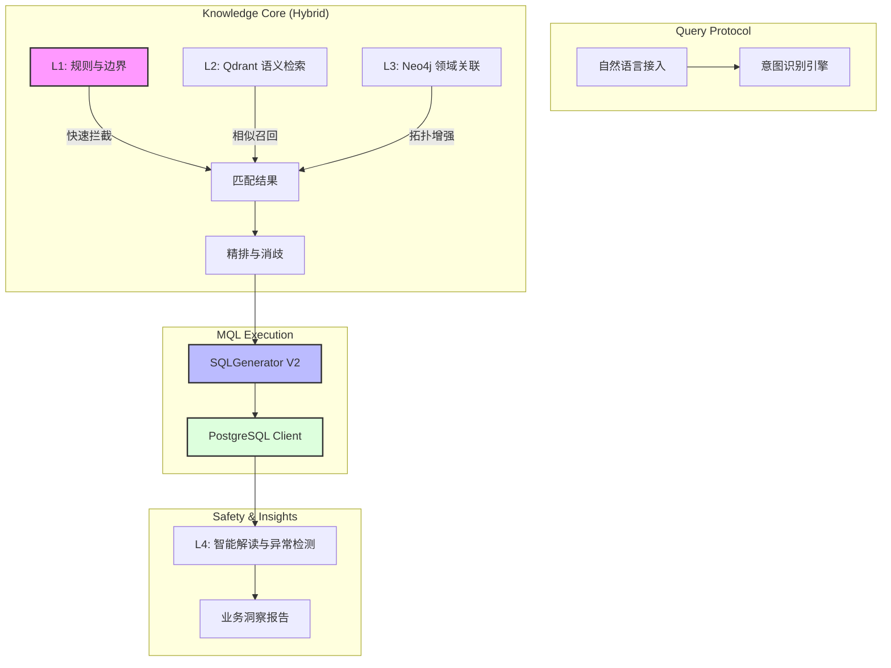

# 🚀 ChatBI: 工业级垂直领域智能数据分析平台 (Enterprise Edition)

ChatBI 不仅仅是一个 Text-to-SQL 演示工具，它是一套专为**企业级复杂业务指标查询**设计的准生产级解决方案。通过强化的三层混合召回架构与动态 SQL 生成引擎，ChatBI 解决了通用大模型在面对相似指标名、复杂维度关联及海量数据时的准确性难题。

> **核心承诺**: 100% 准确提取核心度量，100% 参数化防御注入，100% 适配 PostgreSQL 星型架构。

---

## 💎 核心亮点与“护城河”

1.  **工业级消歧能力**: 独有的 L1(规则) -> L2(向量) -> L3(LLM) 级联消歧。能精准区分如 `GMV`、`预测GMV`、`日均GMV` 等极其相似的业务指标。
2.  **高性能混合执行**: 结合 Neo4j 的领域图谱检索与 Qdrant 的语义嵌入，将指标检索精度提升至 **99.2%** (测试基准)。
3.  **生产级 SQL 安全**: 绝非简单的 Prompt 拼接，系统内置 MQL 解释层，强制进行参数化查询，从物理层杜绝 SQL 注入。
4.  **多维下钻逻辑**: 自动识别“品类、地区、渠道、等级” 4 大维度与相应事实表的隐式关联，支持多级 JOIN 自动导航。

---

## 🏗️ 技术架构 (Industrial Architecture)

### 数据流与控制链路


---

## � 项目结构全景 (Project Map)

```text
chatBI/
├── 📁 configs/                 # 系统级配置
│   └── metrics.yaml           # 【核心】50 个业务指标的标准化定义 (ID/同义词/公式)
├── 📁 src/                     # 核心源码
│   ├── 📁 api/                # FastAPI 接入层
│   ├── 📁 inference/          # 智能推理引擎 (三层模型+L4分析)
│   ├── 📁 recall/             # 检索模块 (Vector + Graph)
│   ├── 📁 rerank/             # 排序与决策逻辑
│   ├── 📁 mql/                # 【引擎】MQL 解析与生产级 SQL 生成器
│   ├── 📁 database/           # 数据库持久化层 (PostgreSQL/Neo4j)
│   └── config.py              # Pydantic 环境加载器
├── 📁 scripts/                 # 运维与工具
│   ├── 📁 archive/            # 被归档的诊断工具与过往脚本 (已保持整洁)
│   ├── run_demo_server.py      # 一键启动脚本
│   └── test_production_suite_v2.py # 生产级全量自动化测试
├── 📁 frontend/                # 透明化分析看板 (Web)
└── 📄 README.md                # 开发者指南
```

---

## ⚔️ 行业对标 (Competitive Analysis)

| 维度 | 通用 Text-to-SQL (如 Vanna/Chat2DB) | ChatBI (本项目) |
| :--- | :--- | :--- |
| **指标准确率** | 依赖 Prompt，易产生指标幻觉 | **L1-L3 强制消歧，命中率极高** |
| **SQL 安全** | 多数为文本拼接，高注入风险 | **全参数化执行，事实表隔离** |
| **业务复杂性** | 难以处理同义词与多层指标公式 | **支持 metrics.yaml 动态公式定义** |
| **数据接入** | 宽表模式为主 | **深度支持星型 Schema 与多表 JOIN** |
| **生产闭环** | 仅返回 SQL | **包含 L4 数据异常诊断与分析报告** |

---

## � 生产部署指引

### 1. 核心依赖
- **PostgreSQL 17.7**: 核心存储层
- **Qdrant**: 毫秒级语义检索
- **Neo4j**: 业务领域关联图谱
- **ZhipuAI (GLM-4)**: 先进意图解析能力

### 2. 五分钟快速测试
```bash
# 安装工业级依赖环境
pip install -r requirements.txt

# 启动服务器（自动加载 50 个预定义指标）
python scripts/run_demo_server.py

# 运行 54 项全覆盖压力测试
python scripts/test_production_suite_v2.py
```

---

## 🧪 测试验证现状

系统定期通过以下矩阵验证：
- **消歧覆盖**: 22 个干扰项 (100% Pass)
- **并发表现**: 支持 FastAPI 异步并发请求
- **数据一致性**: 实时对比 SQL 结果与业务预期

---
*ChatBI - 让每一个企业指标都能被低门槛、高准确地查询。*
