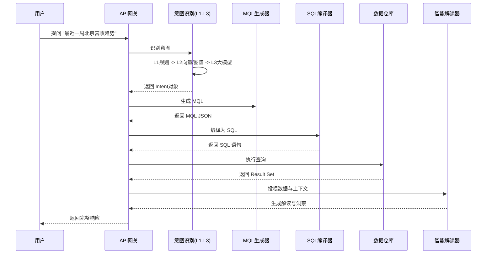

# 📘 ChatBI 系统全量接口参考手册

本文档是 ChatBI 系统的详细技术规范，涵盖了所有可用的 REST API 端点。

---

## 🏗️ 系统架构概览

ChatBI 基于 **"语义-MQL-SQL"** 三层架构，通过混合意图识别和知识图谱增强，实现从自然语言到数据洞察的转化。

### 核心处理链路 (V3 Pipeline)



---

## 1️⃣ 智能问数模块 (V3)

核心业务接口，提供完整的"问答-查询-解读"能力。

**Base URL**: `/api/v3`

### 🟢 完整智能问数 (`/api/v3/query`)

执行完整的智能问数流程，包括意图识别、SQL生成、数据查询、智能解读和根因分析。

- **Method**: `POST`
- **Content-Type**: `application/json`

#### 请求参数

| 参数名 | 类型 | 必填 | 默认值 | 说明 |
| :--- | :--- | :--- | :--- | :--- |
| `query` | string | **是** | - | 用户输入的自然语言问题。例如："2023年Q1华东地区销售额排名" |
| `conversation_id` | string | 否 | `null` | 会话ID。用于多轮对话中维持上下文（如指代消解）。若不传系统会自动生成。 |
| `top_k` | int | 否 | `10` | 意图识别阶段召回的候选指标数量。 |

#### 响应结构

| 字段 | 类型 | 说明 |
| :--- | :--- | :--- |
| `query` | string | 原始查询文本。 |
| `conversation_id` | string | 当前会话ID。 |
| `execution_time_ms` | float | 接口总响应耗时（毫秒）。 |
| `intent` | object | **意图对象**。包含核心指标、时间、维度等解析结果。 |
| `mql` | string | **MQL**。系统生成的中间查询语言字符串。 |
| `sql` | string | **SQL**。最终执行的SQL语句。 |
| `data` | list | **数据结果**。数据库返回的记录列表。 |
| `interpretation` | object | **智能解读**。LLM生成的业务分析摘要。 |
| `root_cause_analysis` | object | **根因分析** (可选)。当数据异常时自动触发。 |
| `all_layers` | list | **执行痕迹**。记录了意图识别各层（L1-L3）的尝试结果与耗时。 |

#### 响应示例

```json
{
  "query": "最近7天的GMV",
  "conversation_id": "550e8400-e29b...",
  "execution_time_ms": 1205.5,
  "intent": {
    "core_query": "GMV",
    "time_range": ["2023-10-01", "2023-10-07"],
    "granularity": "day",
    "dimensions": [],
    "filters": {},
    "source_layer": "L2_Semantic"
  },
  "sql": "SELECT date, sum(value) FROM metrics_table WHERE metric='gmv'...",
  "data": [
    {"date": "2023-10-01", "value": 1200},
    {"date": "2023-10-02", "value": 1150}
  ],
  "interpretation": {
    "summary": "GMV 总体保持稳定。",
    "trend": "stable",
    "key_findings": ["10月1日达到峰值"]
  },
  "root_cause_analysis": null,
  "all_layers": [
    {
      "layer_name": "L1_Rule",
      "success": false,
      "confidence": 0.3,
      "metadata": {}
    },
    {
      "layer_name": "L2_Semantic",
      "success": true,
      "confidence": 0.92,
      "metadata": {"method": "dual_recall"}
    }
  ]
}
```

---

## 2️⃣ 智能分析模块 (V2)

提供更细粒度的分析能力和元数据查询。

**Base URL**: `/api/v2`

### 🟡 根因分析 (`/api/v2/analyze`)

强制对某个指标进行根因分析，寻找波动原因。

- **Method**: `POST`

#### 请求参数

| 参数名 | 类型 | 必填 | 说明 |
| :--- | :--- | :--- | :--- |
| `query` | string | **是** | 用于提取指标和时间范围的查询文本。 |

#### 响应结构

| 字段 | 类型 | 说明 |
| :--- | :--- | :--- |
| `metric` | string | 分析的指标名称。 |
| `root_causes` | list | 发现的根因列表。 |
| `root_causes[].type` | string | 根因类型（维度异常/趋势异常/数据异常）。 |
| `root_causes[].description` | string | 异常描述。 |
| `root_causes[].severity` | string | 严重程度 (`high`/`medium`/`low`)。 |
| `root_causes[].suggestions` | list | 建议措施。 |

---

### 🟡 获取指标列表 (`/api/v2/metrics`)

查询系统中已注册的所有指标。

- **Method**: `GET`

#### 查询参数 (Query Params)

| 参数名 | 类型 | 说明 |
| :--- | :--- | :--- |
| `domain` | string | 按业务域筛选 (如 `销售`, `用户`)。 |
| `category` | string | 按类型筛选 (如 `交易`, `活跃度`)。 |
| `search` | string | 按关键词搜索指标名或描述。 |
| `limit` | int | 返回数量限制，默认 50。 |

---

### 🟡 获取系统统计 (`/api/v2/statistics`)

获取系统当前的知识库规模和能力统计。

- **Method**: `GET`

#### 响应示例

```json
{
  "metrics": {
    "total": 150,
    "by_domain": { "电商": 50, "用户": 30 }
  },
  "capabilities": {
    "supported_dimensions": ["地区", "渠道", "品类"],
    "analysis_types": ["趋势", "下钻", "归因"]
  }
}
```

---

## 3️⃣ 语义检索模块 (V1)

基础搜索能力，用于指标百科或搜索框补全。

**Base URL**: `/api/v1`

### 🔵 语义检索 (`/api/v1/search`)

仅进行指标召回，不查数。使用向量+图谱双路召回。

- **Method**: `POST`

#### 请求参数

| 参数名 | 类型 | 必填 | 默认值 | 说明 |
| :--- | :--- | :--- | :--- | :--- |
| `query` | string | **是** | - | 查询词。 |
| `top_k` | int | 否 | `10` | 返回数量。 |
| `score_threshold` | float | 否 | - | 相似度阈值过滤。 |

#### 响应结构

| 字段 | 类型 | 说明 |
| :--- | :--- | :--- |
| `candidates` | list | 指标候选列表。 |
| `candidates[].metric_id` | string | 指标ID。 |
| `candidates[].name` | string | 指标名。 |
| `candidates[].score` | float | 匹配分数。 |
| `candidates[].source` | string | 来源 (`vector`/`graph`)。 |
| `intent` | object | 简单的意图识别结果。 |

---

## 4️⃣ 数据管理模块

用于管理知识图谱和向量库中的指标元数据。

**Base URL**: `/api/v1/management`

### 🛠️ 批量导入指标 (`/metrics/batch-import`)

- **Method**: `POST`

#### 请求参数

```json
{
  "metrics": [
    {
      "name": "客单价",
      "code": "atv",
      "domain": "销售",
      "description": "平均每个订单的金额",
      "formula": "gmv / order_count",
      "importance": 0.8
    }
  ],
  "generate_summary": true,  // 是否调用LLM生成摘要
  "index_to_vector": true,
  "index_to_graph": true
}
```

#### 响应

返回 `{"task_id": "import_20231001_..."}`，用于后续查询进度。

---

### 🛠️ 单个指标创建 (`/metrics/single`)

- **Method**: `POST`
- **Body**: 同批量导入中的单个 `metrics` 对象。

---

### 🛠️ 查询任务状态 (`/tasks/{task_id}`)

- **Method**: `GET`
- **Response**: 返回任务状态 `pending`/`processing`/`completed`/`failed` 及进度。

---

## 5️⃣ 调试与系统接口

**Base URL**: `/debug`

### 🐞 搜索全链路调试 (`/debug/search-debug`)

"白盒" 接口，返回意图识别、召回、排序、验证每一步的详细输入输出。

- **Method**: `POST`
- **Body**: 同 `/api/v1/search`
- **Response**: 包含 `execution_steps` 数组，展示从 L1 到 Rerank 的完整过程。

### ⚙️ 系统健康检查 (`/health`)

- **Method**: `GET`
- **Response**: `{"status": "healthy", "service": "ChatBI"}`

---

## 附录：通用数据结构

### `Interpretation` (智能解读)

```typescript
interface Interpretation {
  summary: string;       // 核心结论
  trend: "upward" | "downward" | "stable" | "fluctuating"; // 趋势类型
  key_findings: string[]; // 关键发现点 (Top 3)
  confidence: number;    // 可信度 (0-1)
}
```

### `RootCause` (根因)

```typescript
interface RootCause {
  type: string;          // 异常类型
  description: string;   // 描述
  severity: "high" | "medium" | "low";
  suggestions: string[]; // 建议采取的行动
}
```
